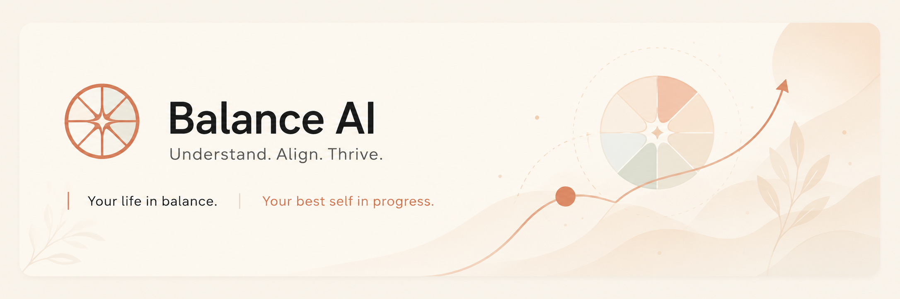
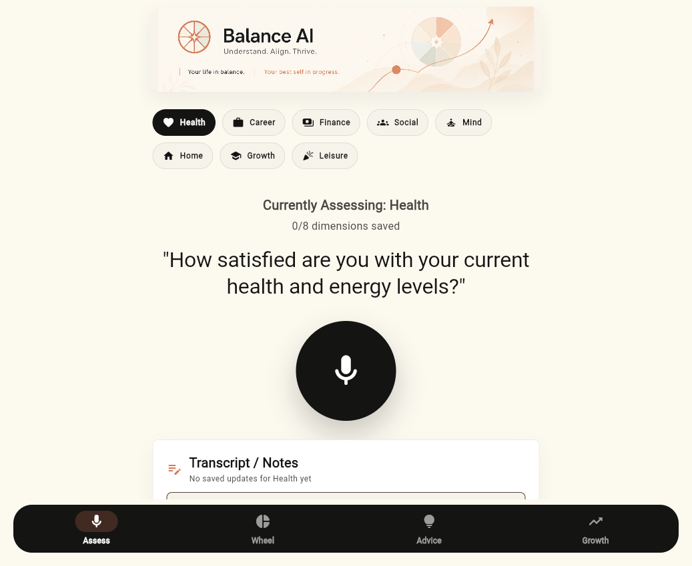
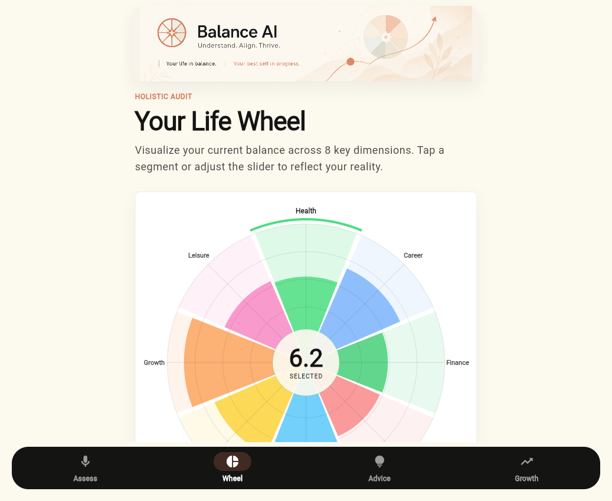
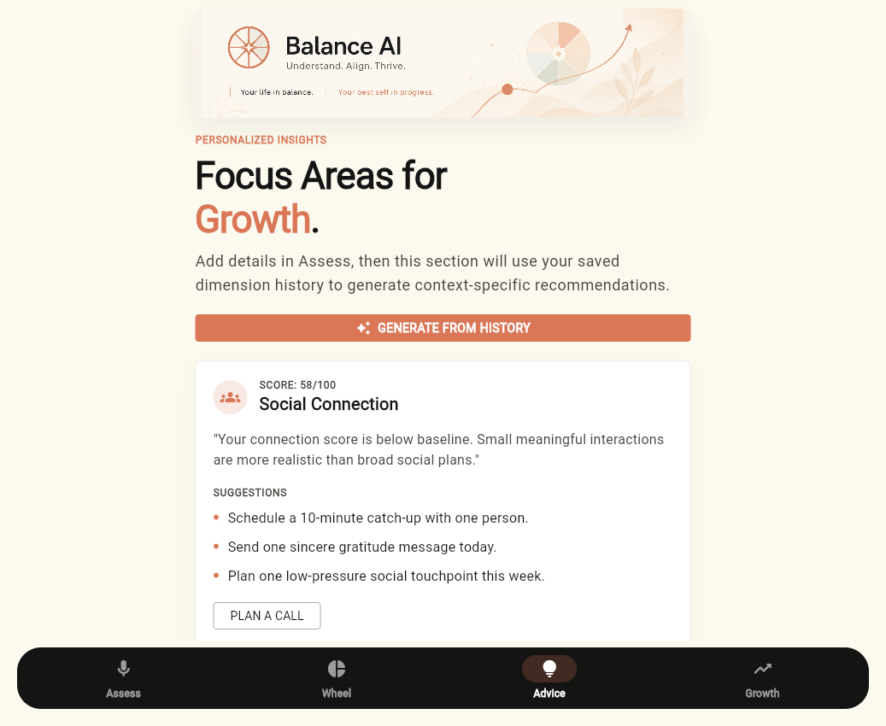
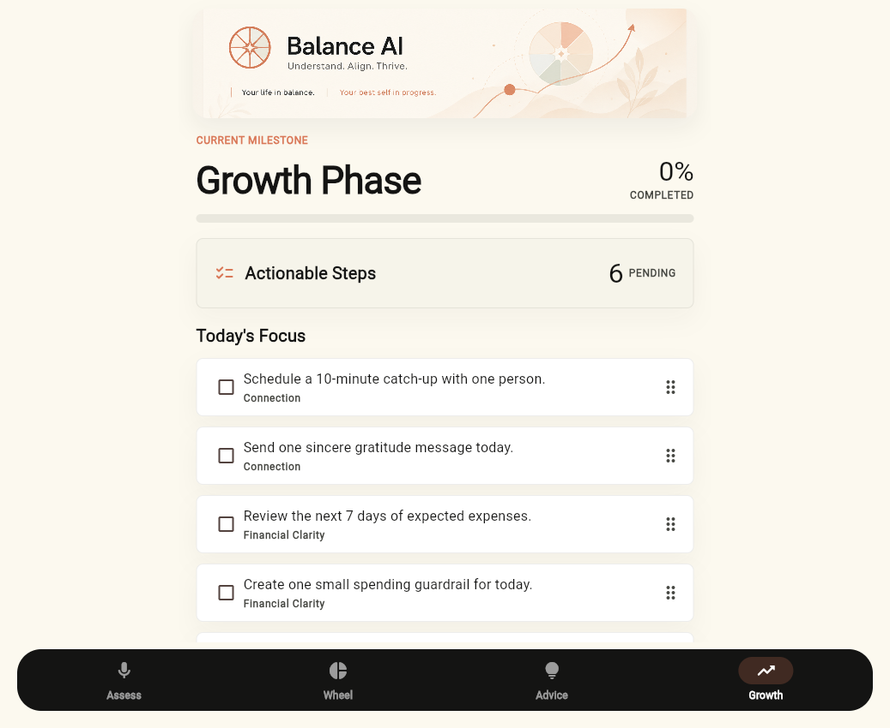

# Balance AI 



Balance AI is a life-balance app for assessing eight life dimensions, tracking historical updates, visualizing a multi-color life wheel, and turning those updates into contextual AI-powered recommendations and growth actions.

The app goal is simple: help a user understand where life feels balanced or strained, save richer notes over time, and convert that history into specific, low-risk next steps.

## Screenshots

| Assess | Wheel |
| --- | --- |
|  |  |

| Advice | Growth |
| --- | --- |
|  |  |

## What The App Does

Balance AI guides the user through Health, Career, Finance, Social, Mind, Home, Growth, and Leisure. Each saved assessment appends a new historical update for the selected dimension and advances to the next dimension. When the user returns to Assess, the latest saved note and score for that dimension are restored so they can add more detail.

The Advice section uses saved history as the context source. MiniMax receives the score map plus grouped per-dimension history, including saved update counts, latest notes, and previous updates. Successful AI recommendations feed both the Advice cards and the Growth action list.

## Architecture

The repo contains two pieces:

`lib/` is the Flutter client. It renders the assessment flow, wheel, advice cards, growth actions, local persistence, and UI assets.

`server/` is a small Node/Express MiniMax proxy. It keeps the MiniMax API key out of the Flutter app for normal development, validates request/response payloads, and trims long history safely before sending context to the model.

For private Android testing, the Flutter client also supports a direct MiniMax mode through build-time Dart defines. This creates a self-sufficient APK, but the embedded API key can be extracted from the APK, so only use that build for personal testing.

## Requirements

- Flutter SDK installed and on `PATH`
- Node.js 20 or newer
- A MiniMax API key for AI recommendations
- Chrome, Edge, or another browser for Flutter web testing
- Android SDK/JDK 17+ for APK builds

## Installation

Clone the repo and install Flutter dependencies:

```powershell
flutter pub get
```

Install the proxy dependencies:

```powershell
cd server
npm install
cd ..
```

Create a proxy environment file:

```powershell
Copy-Item .env.example server\.env
```

Edit `server\.env` and set `MINIMAX_API_KEY`. Do not put the key in Flutter code or commit it.

## Run Locally

Start the MiniMax proxy:

```powershell
cd server
npm run dev
```

In another terminal, run the Flutter app:

```powershell
flutter run -d chrome --dart-define=BALANCE_API_BASE_URL=http://127.0.0.1:8787
```

For a web release build:

```powershell
flutter build web --dart-define=BALANCE_API_BASE_URL=http://127.0.0.1:8787
```

If you serve `build\web` locally, open the app URL, not the proxy URL. The proxy health page is `http://127.0.0.1:8787/health`; the Flutter app is whatever server is hosting `build\web`.

## Android APK

The recommended development setup is still the proxy above, because it keeps secrets out of the client. For a self-sufficient private test APK, build with MiniMax credentials passed at compile time:

```powershell
$keyLine = Get-Content -LiteralPath 'server\.env' | Where-Object { $_ -match '^MINIMAX_API_KEY=' } | Select-Object -First 1
$apiKey = $keyLine -replace '^MINIMAX_API_KEY=', ''
flutter build apk --debug `
  --dart-define=BALANCE_MINIMAX_API_KEY=$apiKey `
  --dart-define=BALANCE_MINIMAX_BASE_URL=https://api.minimax.io/anthropic `
  --dart-define=BALANCE_MINIMAX_MODEL=MiniMax/M2.7
```

The debug APK is written to `build\app\outputs\flutter-apk\app-debug.apk`. Treat APKs built this way like private credentials: do not publish them, attach them to public issues, or share them outside your own test devices.

## Testing

Run Flutter tests:

```powershell
flutter test
```

Run proxy tests:

```powershell
cd server
npm test
npm run build
```

## MiniMax Setup

The included `.env.example` uses the Anthropic-compatible MiniMax M2.7 endpoint:

```text
MINIMAX_API=anthropic-messages
MINIMAX_BASE_URL=https://api.minimax.io/anthropic
MINIMAX_MODEL=MiniMax/M2.7
```

The proxy also supports an OpenAI-style MiniMax chat endpoint if configured that way. The Flutter client uses the local proxy by default, and switches to direct MiniMax only when `BALANCE_MINIMAX_API_KEY` is provided at build time.

## Project Structure

```text
lib/
  data/       local storage, voice service, MiniMax proxy client
  domain/     dimensions, scoring, models, fallback recommendations
  state/      Riverpod controller and app state
  ui/         screens and shared components
server/
  src/        Express proxy, MiniMax adapters, prompt shaping, tests
docs/
  screenshots/ current app screenshots for README
  reference/   design references used during implementation
```

## Safety Notes

The app does not provide medical, legal, financial, or therapy advice. MiniMax is instructed to produce low-risk behavioral suggestions, and local fallback advice remains available when the model or network is unavailable.
